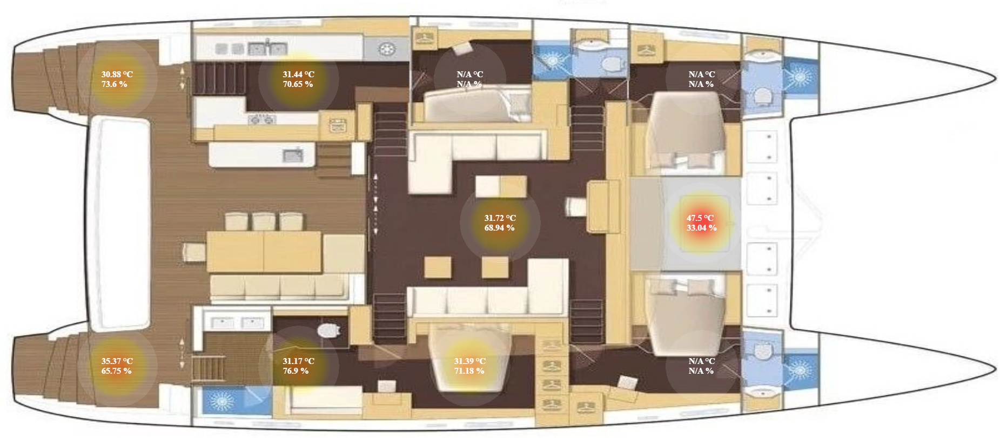

# auralis-heatmap
SV Auralis Heatmap with Zigbee2mqtt and Tuya Sensors

## Heatmap of a Boat, or any other underlaying picture

This project simply draws multiple heatmap points over a provided image.
This way you can show it in your home, office, datacenter or whatever you want.

## Example 

# Copyright

(c) by Martin Verges see file "LICENSE"
